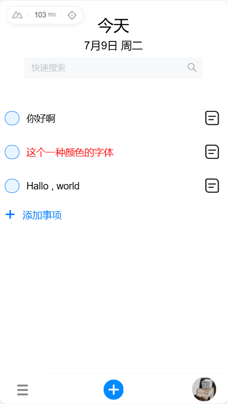
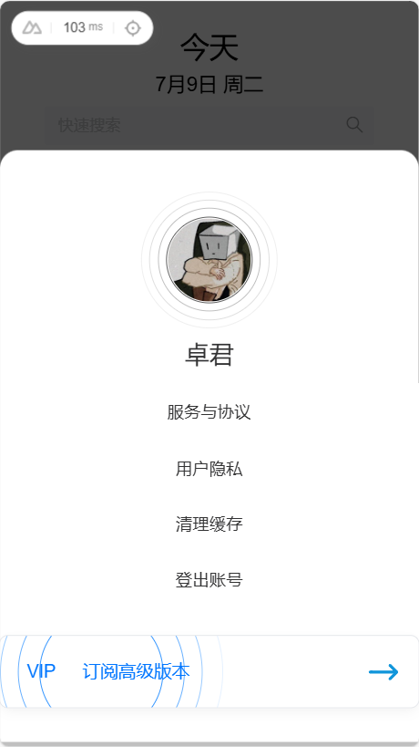
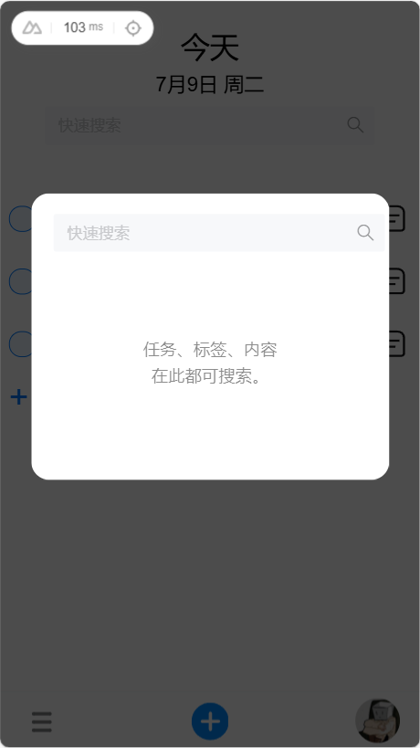
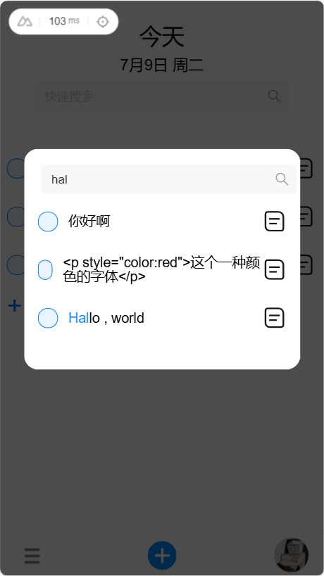
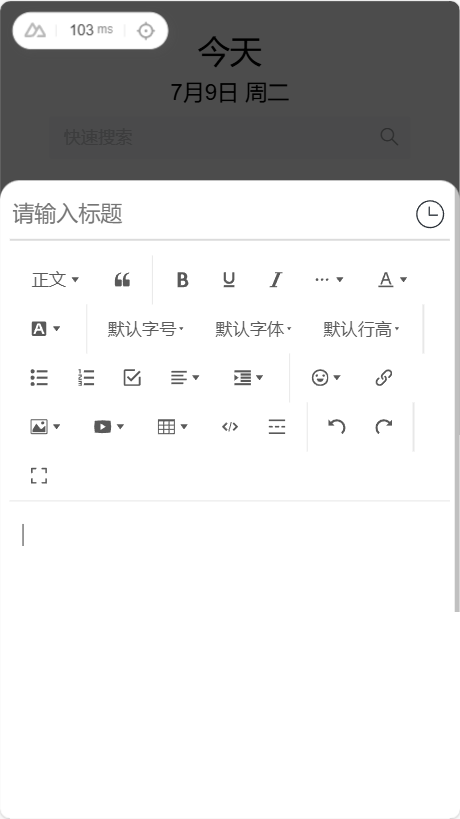
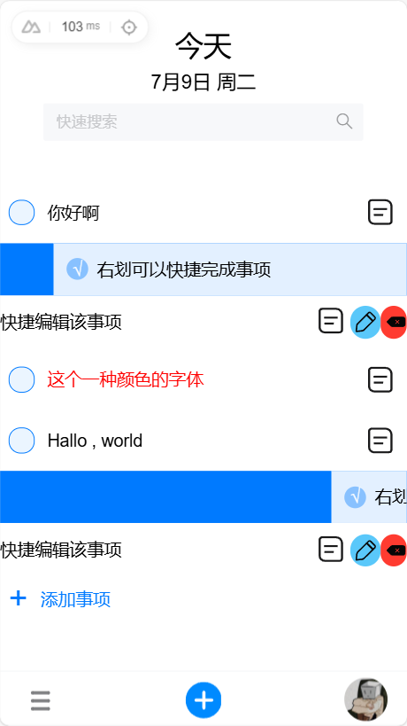
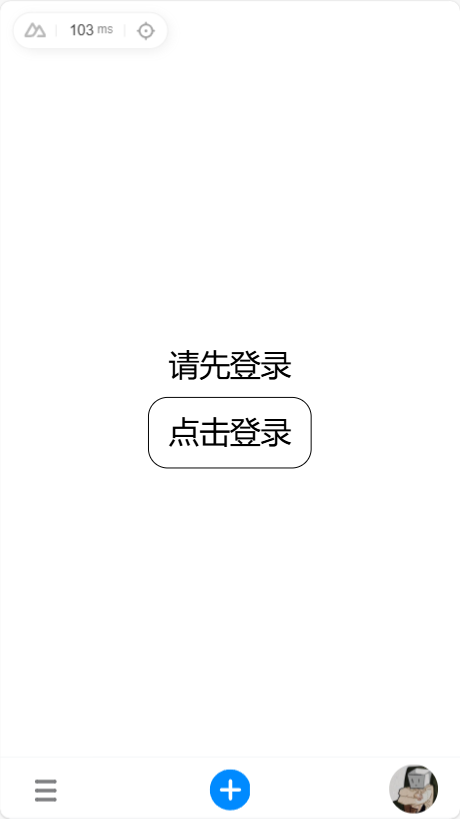
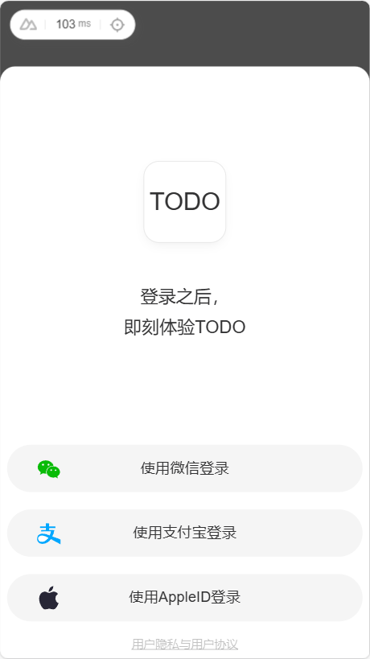
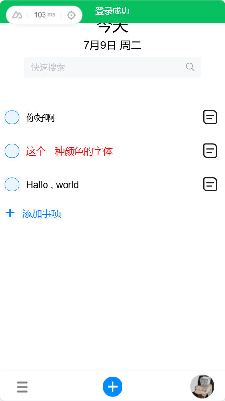
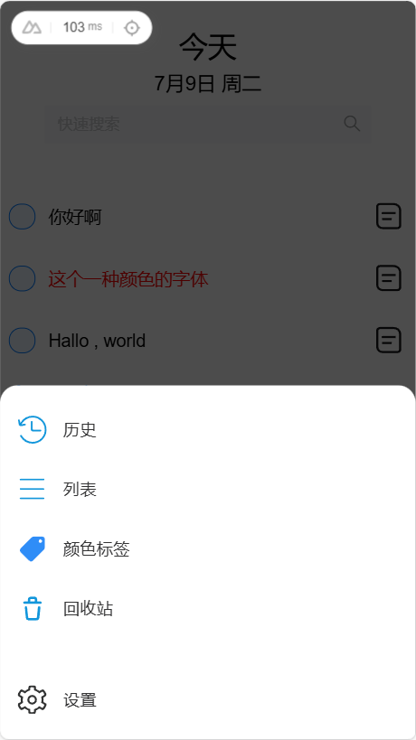

## 注意事项
1. 应使用pnpm进行下载
2. 需要全局下载sharp与libvips，不下载只会导致图片加载不出来，其实影响并不是很大。
### 在 .npmrc 下 配置这两个选项：（注意：.npmrc一般在该文件下面：Administrator 或者 C:\Users\Administrator） sharp_binary_host=https://npm.taobao.org/mirrors/sharp sharp_libvips_binary_host=https://npm.taobao.org/mirrors/sharp-libvips
### win+R输入cmd，下载全局 npm i -g sharp
### 将node_modules删掉，而后重新下载即可

